<!-- HEADER -->

<picture>
  <source srcset="images\header.webp">
  
</picture>

<!-- INTRODUCTION -->

> _Exploring the frontier of Natural Language Processing and Agentic Systems to bridge the gap between human intent and machine execution._

**Welcome to my GitHub profile!**

<!-- CURRENT STATUS -->

I am a \ an ...

-  **Software & Data Engineering** Working Student [**@Doc Cirrus GmbH**][company-url]

-  **MSc Data Science** student [**@Berliner Hochschule für Technik (BHT)**][bht-url].

-  **Full-Stack Engineer** with **2+** years of experience in the Ed-Tech domain.

-  **Deep Learning & NLP Engineer** leveraging a strong Full-Stack experience to build scalable AI applications.

-  Open to collaborative projects that tackle real-world problems using Machine Learning and modern Software Engineering practices.

<!-- TECHNOLOGY STACK -->

## ⚙️ Technologies & Tools

#### 🧠 Deep Learning & Natural Language Processing (DL/NLP)

[![Python][python-shield]][python-url]
[![Pytorch][pytorch-shield]][pytorch-url]
[![TensorFlow][tensorflow-shield]][tensorflow-url]
[![Keras][keras-shield]][keras-url]
[![Hugging Face][huggingface-shield]][huggingface-url]
[![Sklearn][sklearn-shield]][sklearn-url]
[![Numpy][numpy-shield]][numpy-url]
[![Pandas][pandas-shield]][pandas-url]
[![FastAPI][fastapi-shield]][fastapi-url]
[![Kaggle][kaggle-shield]][kaggle-url]
[![Colab][colab-shield]][colab-url]
[![Jupyter][jupyter-shield]][jupyter-url]

####  Data Engineering & MLOps

[![Docker][docker-shield]][docker-url]
[![ONNX][onnx-shield]][onnx-url]
[![TorchServe][torchserve-shield]][torchserve-url]
[![Azure][azure-shield]][azure-url]
[![MySQL][mysql-shield]][mysql-url]
[![MongoDB][mongodb-shield]][mongodb-url]
[![Redis][redis-shield]][redis-url]

####  Full-Stack Engineering

[![Next.js][nextjs-shield]][nextjs-url]
[![React][react-shield]][react-url]
[![Angular][angular-shield]][angular-url]
[![Node][node-shield]][node-url]
[![Express][express-shield]][express-url]
[![EJS][ejs-shield]][ejs-url]
[![JQuery][jquery-shield]][jquery-url]
[![TailwindCSS][tailwindcss-shield]][tailwindcss-url]
[![Bootstrap][bootstrap-shield]][bootstrap-url]
[![PostCSS][postcss-shield]][postcss-url]
[![CSS modules][css-modules-shield]][css-modules-url]
[![SCSS][scss-shield]][scss-url]
[![CSS3][css3-shield]][css3-url]
[![HTML5][html5-shield]][html5-url]
[![Figma][figma-shield]][figma-url]

####  Programming Languages

[![TypeScript][typescript-shield]][typescript-url]
[![JavaScript][javascript-shield]][javascript-url]
[![C#][dotnet-shield]][dotnet-url]
[![R][r-shield]][r-url]
[![C++][c++-shield]][c++-url]

#### 🔄️ Developer Tools

[![Editor][editor-shield]][editor-url]
[![Git][git-shield]][git-url]
[![GitHub][github-shield]][github-profile-url]
[![Claude][claude-shield]][claude-url]
[![ChatGPT][chatgpt-shield]][chatgpt-url]
[![Gemini][gemini-shield]][gemini-url]
[![Copilot][copilot-shield]][copilot-url]
[![Chrome][chrome-shield]][chrome-url]
[![Postman][postman-shield]][postman-url]
[![RStudio][rstudio-shield]][rstudio-url]

<!-- GITHUB PROFILE STATS -->

## 📄 Github Profile Stats

![Visitors][visitors-badge]
![Github Stars][github-stars-shield]
![Github Followers][github-followers-shield]

####  Github Stats

<picture>
  <source media="(prefers-color-scheme: dark)" srcset="images/fallback/github-stats-dark.svg">
  
</picture>

###  Most Used Language

<picture>
  <source media="(prefers-color-scheme: dark)" srcset="images/fallback/github-language-dark.svg">
  
</picture>

###  Streak Stats

<picture>
  <source media="(prefers-color-scheme: dark)" srcset="images/fallback/github-streak-dark.svg">
  
</picture>

###  Trophies Stats

<picture>
  <source media="(prefers-color-scheme: dark)" srcset="images/fallback/github-trophy-dark.svg">
  
</picture>

## 🎓 Published Papers

[![SSRN][ssrn-shield]][ssrn-paper-url]

With a follow up paper to extend the research,

[![IEEE][ieee-shield]][ieee-paper-url]

This research addresses the significant problems caused by handwritten drug prescriptions, such as medication errors from misinterpretation and the lack of standardized data for research.

[![Quote Light][quote-light]][quote-light-base]
[![Quote Dark][quote-dark]][quote-dark-base]

## 📶 Contact

Feel free to reach out, I'll be happy to hear from you.

<!-- SOCIAL SHIELDS -->

[![Gmail][gmail-shield]][gmail-url]
[![Linkedin][linkedin-shield]][linkedin-url]
[![Kaggle][kaggle-profile-shield]][kaggle-url]
[![StackOverflow][stackoverflow-shield]][stackoverflow-url]

 

### Cached badge snapshots

The images shown above are cached snapshots stored in `images/fallback/`. A scheduled GitHub Action (`.github/workflows/cache-badges.yml`) attempts to fetch the live badge images daily and commits updated snapshots when available. If a remote service is unreachable (HTTP 503 or similar), the last successful snapshot remains displayed.

The workflow runs on push and every 6 hours by default. It uses conditional requests (ETag / Last-Modified) and stores per-file metadata alongside each cached image as `images/fallback/<name>.etag` and `images/fallback/<name>.lm` to avoid unnecessary downloads.

<!-- FOOTER QUOTE -->

<a href="https://github.com/DAShaikh10">![Built with love][built-with-love-badge]</a>

<!-- COLLEGE URL -->

[bht-url]: https://www.bht-berlin.de/en/

<!-- COMPANY URL -->

[company-url]: https://www.doc-cirrus.com/

<!-- MARKDOWN shieldS -->

[angular-shield]: https://img.shields.io/badge/Angular-informational?style=for-the-badge&logo=angular&labelColor=ec2299&color=white
[azure-shield]: https://img.shields.io/badge/Azure-informational?style=for-the-badge&color=007fff
[bootstrap-shield]: https://img.shields.io/badge/Bootstrap-informational?style=for-the-badge&logo=bootstrap&labelColor=white&color=7952b3
[c++-shield]: https://img.shields.io/badge/C++-informational?style=for-the-badge&logo=c%2B%2B&labelColor=gray
[chatgpt-shield]: https://img.shields.io/badge/ChatGPT-informational?style=for-the-badge&logo=chatgpt&logoColor=white&color=00a67e
[claude-shield]: https://img.shields.io/badge/Claude-informational?style=for-the-badge&logo=anthropic&logoColor=white&labelColor=d97757&color=white
[claude-code-shield]: https://img.shields.io/badge/Claude%20Code-informational?style=for-the-badge&logo=anthropic&logoColor=white&color=1a1a1a
[chrome-shield]: https://img.shields.io/badge/Browser-Chrome-red?style=for-the-badge&logo=google-chrome&logoColor=white
[colab-shield]: https://img.shields.io/badge/Colab-white?style=for-the-badge&logo=google-colab&logoColor=orange&labelColor=gray
[copilot-shield]: https://img.shields.io/badge/Copilot-informational?style=for-the-badge&logo=githubcopilot&logoColor=white&labelColor=1a1a1a&color=white
[css-modules-shield]: https://img.shields.io/badge/CSS%20Modules-Informational?style=for-the-badge&logo=cssmodules&labelColor=000000&color=white
[css3-shield]: https://img.shields.io/badge/CSS3-informational?style=for-the-badge&logo=css&labelColor=1572b6&color=white
[docker-shield]: https://img.shields.io/badge/Docker-informational?style=for-the-badge&logo=Docker&labelColor=white&color=2496ED
[dotnet-shield]: https://img.shields.io/badge/C%23%20%5C%20.NET-informational?style=for-the-badge&logo=dotnet&labelColor=512BD4&color=white
[editor-shield]: https://img.shields.io/badge/Editor-VS_Code-informational?style=for-the-badge&logo=visual-studio-code&logoColor=007acc&color=007acc
[ejs-shield]: https://img.shields.io/badge/EJS-informational?style=for-the-badge&logo=e&labelColor=darkorange&color=white
[express-shield]: https://img.shields.io/badge/Express-informational?style=for-the-badge&logo=express&labelColor=black&color=white
[fastapi-shield]: https://img.shields.io/badge/FastAPI-informational?style=for-the-badge&logo=fastapi&labelColor=white&color=009688
[figma-shield]: https://img.shields.io/badge/Figma-informational?style=for-the-badge&logo=figma&labelColor=white&color=f24e1e
[gemini-shield]: https://img.shields.io/badge/Gemini-informational?style=for-the-badge&logo=googlegemini&logoColor=white&labelColor=8e75b2&color=white
[git-shield]: https://img.shields.io/badge/Version%20Control-Git-informational?style=for-the-badge&logo=git&color=f05032
[github-shield]: https://img.shields.io/badge/-GitHub-informational?style=for-the-badge&logo=github&color=181717
[github-followers-shield]: https://img.shields.io/github/followers/DAShaikh10?style=social
[github-stars-shield]: https://img.shields.io/github/stars/DAShaikh10?style=social
[gmail-shield]: https://img.shields.io/badge/Danish%20Ali-grey?style=for-the-badge&logo=gmail
[html5-shield]: https://img.shields.io/badge/HTML5-informational?style=for-the-badge&logo=html5&labelColor=white&color=e34f26
[huggingface-shield]: https://img.shields.io/badge/Hugging%20Face-informational?style=for-the-badge&logo=huggingface&logoColor=black&color=FFD21E
[ieee-shield]: https://img.shields.io/badge/Voice%20Prescription%20using%20Natural%20Language%20Understanding-informational?style=for-the-badge&logo=ieee
[javascript-shield]: https://img.shields.io/badge/JavaScript-informational?style=for-the-badge&logo=javascript&labelColor=gray&color=f7df1e
[jquery-shield]: https://img.shields.io/badge/JQuery-informational?style=for-the-badge&logo=jquery&labelColor=0769ad&color=white
[jupyter-shield]: https://img.shields.io/badge/Jupyter-Informational?style=for-the-badge&logo=jupyter&labelColor=white&color=f37626
[kaggle-shield]: https://img.shields.io/badge/Kaggle-informational?style=for-the-badge&logo=kaggle&labelColor=white&color=20beff
[kaggle-profile-shield]: https://img.shields.io/badge/Danish%20Ali-informational?style=for-the-badge&logo=kaggle&labelColor=white&color=20beff
[keras-shield]: https://img.shields.io/badge/Keras-informational?style=for-the-badge&logo=keras&color=d00000
[linkedin-shield]: https://img.shields.io/badge/in-Danish%20Ali-0a66c2?style=for-the-badge&logoColor=white
[mongodb-shield]: https://img.shields.io/badge/MongoDB-informational?style=for-the-badge&logo=mongodb&labelColor=white&color=47a248
[mongoose-shield]: https://img.shields.io/badge/Mongoose-informational?style=for-the-badge&logo=mongoose&labelColor=880000&color=white
[mysql-shield]: https://img.shields.io/badge/MySQL-informational?style=for-the-badge&logo=mysql&labelColor=white&color=4479a1
[nextjs-shield]: https://img.shields.io/badge/Next.js-informational?style=for-the-badge&logo=nextdotjs&labelColor=212121&color=white
[node-shield]: https://img.shields.io/badge/Node-informational?style=for-the-badge&logo=nodedotjs&labelColor=white&color=339933
[numpy-shield]: https://img.shields.io/badge/Numpy-informational?style=for-the-badge&logo=numpy&logoColor=013243&labelColor=white&color=013243
[onnx-shield]: https://img.shields.io/badge/ONNX-informational?style=for-the-badge&logo=onnx&logoColor=black&color=white
[pandas-shield]: https://img.shields.io/badge/Pandas-informational?style=for-the-badge&logo=pandas&labelColor=150458&color=white
[postcss-shield]: https://img.shields.io/badge/PostCSS-Informational?style=for-the-badge&logo=postcss&labelColor=DD3A0A&color=white
[postman-shield]: https://img.shields.io/badge/Postman-informational?style=for-the-badge&logo=postman&labelColor=white&color=ef5b25
[python-shield]: https://img.shields.io/badge/Python-informational?style=for-the-badge&logo=python&logoColor=ffdc51&labelColor=gray&color=3776ab
[pytorch-shield]: https://img.shields.io/badge/Pytorch-informational?style=for-the-badge&logo=pytorch&color=white
[r-shield]: https://img.shields.io/badge/R-Informational?style=for-the-badge&logo=r&labelColor=276DC3&color=white
[react-shield]: https://img.shields.io/badge/React-informational?style=for-the-badge&logo=react&labelColor=black&color=white
[redis-shield]: https://img.shields.io/badge/Redis-informational?style=for-the-badge&logo=redis&logoColor=white&color=DC382D
[rstudio-shield]: https://img.shields.io/badge/RStudio-Informational?style=for-the-badge&logo=rstudioide&labelColor=white&color=75AADB
[scss-shield]: https://img.shields.io/badge/SCSS-Informational?style=for-the-badge&logo=sass&labelColor=white&color=CC6699
[sklearn-shield]: https://img.shields.io/badge/scikit--learn-Informational?style=for-the-badge&logo=scikit-learn&logoColor=white&labelColor=blue&color=f7931e
[stackoverflow-shield]: https://img.shields.io/badge/Danish%20Ali-white?style=for-the-badge&logo=stackoverflow
[ssrn-shield]: https://img.shields.io/badge/Speech%20Recognition%20Based%20Prescription%20Generator-informational?style=for-the-badge&logo=ssrn&logoColor=darkblue&color=white
[tailwindcss-shield]: https://img.shields.io/badge/TailwindCSS-informational?style=for-the-badge&logo=tailwindcss&labelColor=white&color=06b6d4
[tensorflow-shield]: https://img.shields.io/badge/TensorFlow-informational?style=for-the-badge&logo=tensorflow&logoColor=white&labelColor=FF6F00&color=white
[torchserve-shield]: https://img.shields.io/badge/TorchServe-informational?style=for-the-badge&logo=pytorch&logoColor=white&color=EE4C2C
[typescript-shield]: https://img.shields.io/badge/TypeScript-informational?style=for-the-badge&logo=typescript&labelColor=white&color=3178c6

<!-- MARKDOWN URL -->

[angular-url]: https://angular.dev/
[azure-url]: https://azure.microsoft.com/en-us/get-started/azure-portal/
[bootstrap-url]: https://getbootstrap.com
[c++-url]: https://isocpp.org
[chatgpt-url]: https://chatgpt.com/
[claude-url]: https://claude.ai/
[chrome-url]: https://www.google.com/intl/en_us/chrome
[colab-url]: https://colab.research.google.com
[copilot-url]: https://github.com/features/copilot
[css-modules-url]: https://github.com/css-modules/css-modules
[css3-url]: https://developer.mozilla.org/en-US/docs/Web/CSS
[docker-url]: https://www.docker.com/
[dotnet-url]: https://dotnet.microsoft.com/en-us/
[editor-url]: https://code.visualstudio.com
[ejs-url]: https://ejs.co
[express-url]: https://expressjs.com
[fastapi-url]: https://fastapi.tiangolo.com/
[figma-url]: https://www.figma.com
[gemini-url]: https://gemini.google.com/
[git-url]: https://git-scm.com
[github-profile-url]: https://github.com/DAShaikh10
[gmail-url]: mailto:D.A.Shaikh10@gmail.com
[html5-url]: https://developer.mozilla.org/en-US/docs/Glossary/HTML5
[huggingface-url]: https://huggingface.co/
[ieee-paper-url]: https://ieeexplore.ieee.org/document/9807998
[javascript-url]: https://developer.mozilla.org/en-US/docs/Web/JavaScript
[jquery-url]: https://jquery.com
[jupyter-url]: https://jupyter.org/
[kaggle-url]: https://www.kaggle.com/dashaikh/
[keras-url]: https://keras.io
[linkedin-url]: https://www.linkedin.com/in/danish-ali-shaikh
[mongodb-url]: https://www.mongodb.com/
[mongoose-url]: https://mongoosejs.com
[mysql-url]: https://www.mysql.com/
[nextjs-url]: https://nextjs.org/
[node-url]: https://nodejs.org
[numpy-url]: https://numpy.org
[onnx-url]: https://onnx.ai/
[pandas-url]: https://pandas.pydata.org
[postcss-url]: https://postcss.org/
[postman-url]: https://www.postman.com
[python-url]: https://www.python.org
[pytorch-url]: https://pytorch.org
[r-url]: https://www.r-project.org/
[rstudio-url]: https://posit.co/download/rstudio-desktop/
[react-url]: https://reactjs.org
[redis-url]: https://redis.io/
[scss-url]: https://sass-lang.com/
[sklearn-url]: https://scikit-learn.org
[stackoverflow-url]: https://stackoverflow.com/users/17414897/dashaikh
[ssrn-paper-url]: https://papers.ssrn.com/sol3/papers.cfm?abstract_id=3867738
[tailwindcss-url]: https://v1.tailwindcss.com
[tensorflow-url]: https://www.tensorflow.org/
[torchserve-url]: https://pytorch.org/serve/
[typescript-url]: https://www.typescriptlang.org

<!-- MARKDOWN QUOTE -->

[quote-light]: https://quotes-github-readme.vercel.app/api?theme=catppuccin_latte#gh-light-mode-only
[quote-light-base]: https://quotes-github-readme.vercel.app/api#gh-light-mode-only
[quote-dark]: https://quotes-github-readme.vercel.app/api?type=horizontal&theme=algolia#gh-dark-mode-only
[quote-dark-base]: https://quotes-github-readme.vercel.app/api?type=horizontal#gh-dark-mode-only

<!-- MARDOWN BADGES -->

[built-with-love-badge]: http://ForTheBadge.com/images/badges/built-with-love.svg
[visitors-badge]: images/fallback/visitors-fallback.svg
